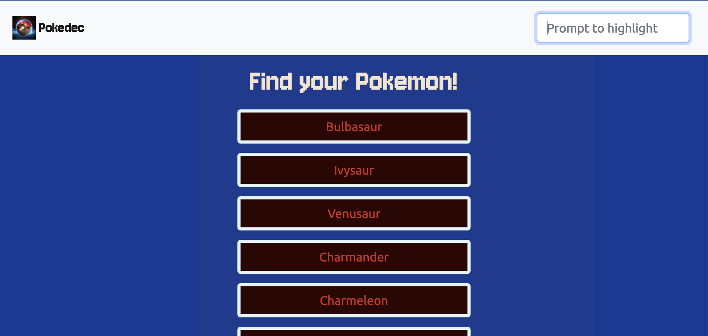

# Simple JavaScript App: Pokedec

- [Description](#description)
- [Objective](#objective)
- [Technologies](#technologies)
- [Setup](#setup)
  * [Hosted on GitHub Pages](#hosted-on-github-pages)
  * [Local Setup](#local-setup)
- [Key Features](#key-features)
  * [Using an API to get Pokemon data](#using-an-api-to-get-pokemon-data)
  * [List of Buttons with Names](#list-of-buttons-with-names)
  * [Search Bar](#search-bar)
  * [Display Image and Data](#display-image-and-data)
  * [Bootstrap](#bootstrap)
- [Impressions](#impressions)
  * [Initial Page](#initial-page)
  * [Search Field](#search-field)
  * [Modal](#modal)
- [Conclusion](#conclusion)

## Description
Pokedec is a simple JavaScript app that was developed as a learning project to understand the principles of programming with JavaScript. By building this small web application, which utilizes HTML, CSS, and JavaScript to load data from an external API and allows for the detailed viewing of data points. The development process can be followed through the commit messages and branches of this project, providing insight into each step taken towards achieving the objective of creating a functional and interactive web application.

## Technologies
In this projects the following technologies were used:
- HTML
- CSS
- JavaScript
- Bootstrap

## Setup
### Hosted on GitHub Pages
The project is hosted on GitHub Pages and can be accessed via the following link: [Pokedec](https://otmarkirch.github.io/simple-js-app/)

### Local Setup
To run the project locally, you can clone the repository and open the `index.html` file in your browser. The project does not require any additional setup or installation.

## Key Features

### Using an API to get Pokemon data
The `script.js`file initializes a repository of Pokemons with an IIEF function. When initialized, data about Pokemons are loaded into a list via API. This data includes the name of the Pokemon and a URL with further information. 
### List of Buttons with Names
The name is used to create buttons automatically via JavaScript using the DOM. The user can click on these buttons to receive further information. 
### Search Bar
The search bar in the navigation section can be used to highlight buttons. Buttons with the name containing the given string change their text color to yellow.
### Display Image and Data
The buttons can be clicked to receive further information about the chosen Pokemon. To fetch that information, the API is used again. Details of the pokemon are now displayed in a modal.
### Bootstrap
Bootstrap is used as the framework. The code has been refactored accordingly.

## Impressions

### Initial Page
The starting page shows all available Pokemon as buttons and a search field in the upper right corner.

### Search Field
The search field can be used to restrict the list of Pokemons buttons to those containing the given string.

### Modal
When clicking on a Pokemon button, a modal appears with further information about the Pokemon.

## Conclusion

### Challenges
Programming the search bar, I found a challenging task. Beyond the simple reduction of the list, viewing the Pokemons, I wanted to highlight the characters which are part of the search string. This involved taking apart and putting together the string again. It was more challenging, than I initially anticipated (respective code in [script.js, line 90](https://github.com/your-username/your-repo/blob/main/scripts.js#L90)). But the result was worth the effort as you can see in the image of the [Search Field](#search-field) above.

### Future Improvements
As the next step in this project, I would like to implement a way to navigate through the list of Pokemons while the modal is open. This could be done via a back and forth arrow. This way, it would be best to going back and forth only between those Pokemon that are covered by the search string.

### Final Thoughts
The project was a great learning experience. It helped me to understand the principles of programming with JavaScript and how to use external APIs to load data into a web application. The project also provided insights into the use of Bootstrap as a framework for web development. The project was a great way to practice and improve my skills in web development and JavaScript programming.